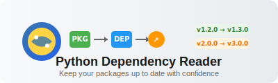
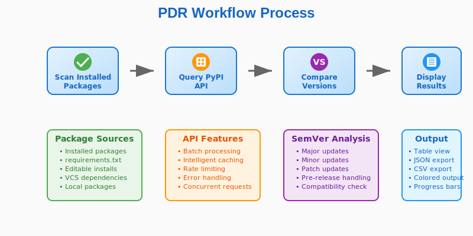
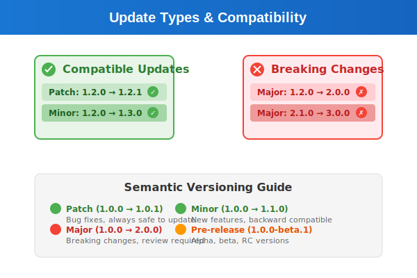

<div align="center">



[](https://opensource.org/licenses/MIT)
[](https://www.python.org/downloads/)
[](https://click.palletsprojects.com/)
[](https://pypi.org)

**A powerful command-line utility for identifying outdated Python packages**

*Compare installed versions with PyPI using intelligent SemVer analysis*

</div>

## 📊 How It Works

<div align="center">



</div>

## ⚡ Quick Demo

```bash
$ python main.py check
Checking packages  [####################################]  100%          
Outdated Packages:
---------------------------------------------------------------
Package            | Installed    | Latest | Type  | Compatible
---------------------------------------------------------------
pip                | 25.0.1       | 25.2   | minor | ✓
setuptools         | 80.7.1       | 80.9.0 | minor | ✓
jaraco.context     | 5.3.0        | 6.0.1  | major | ✗
more-itertools     | 10.3.0       | 10.7.0 | minor | ✓
---------------------------------------------------------------

Summary:
Total packages with updates: 14
Major updates: 2 (⚠️  breaking changes)
Minor updates: 12 (✅ safe to update)
```

## 🎯 Semantic Versioning Guide

<div align="center">



</div>

## 🚀 Feature Overview

<div align="center">


</div>

### 🎯 Core Capabilities

| Feature | Description | Benefit |
|---------|-------------|---------|
| 📦 **Smart Package Detection** | Automatically scans installed packages or reads from requirements.txt | No manual package listing needed |
| 🌐 **PyPI Integration** | Real-time version checking against Python Package Index | Always current version information |
| 🔍 **SemVer Compatibility** | Intelligent semantic versioning analysis with breaking change detection | Safe upgrade recommendations |
| 📊 **Multiple Output Formats** | Table, JSON, and CSV export options | Perfect for any workflow |
| ⚡ **Batch Processing** | Efficient concurrent API calls with rate limiting | Fast processing of large package lists |
| 🧪 **Pre-release Handling** | Configurable inclusion of alpha, beta, and RC versions | Stay on the cutting edge |
| 🎨 **Colorful CLI** | Rich, colored terminal output with progress indicators | Beautiful and informative interface |
| 🔧 **Advanced Filtering** | Filter by update type (major, minor, patch) | Focus on what matters most |
| 🔄 **CI/CD Ready** | Export results for automated workflows | Perfect for continuous integration |
| 📝 **Comprehensive Logging** | Detailed logging with configurable levels | Debug and monitor with confidence |

## 📦 Installation

### Prerequisites

- Python 3.7 or higher
- pip package manager

### Install Dependencies

```bash
# Install required packages
pip install click>=8.0.0 colorlog>=6.0.0 packaging>=21.0.0 requests>=2.25.0 toml>=0.10.0 psutil>=7.0.0

# Additional dependencies for full functionality
pip install urllib3>=1.21.1 charset-normalizer>=2.0.0 idna>=2.5 certifi>=2017.4.17
```

### Quick Start

```bash
# Clone or download the project files
git clone <repository-url>
cd python-dependency-reader

# Install dependencies
pip install click colorlog packaging requests toml psutil urllib3 charset-normalizer idna certifi

# Run the tool
python main.py --help
```

## 🚀 Usage

### Basic Commands

```bash
# Check all installed packages for updates
python main.py check

# Check packages from requirements.txt
python main.py check --requirements requirements.txt

# Get detailed information about a specific package
python main.py info requests

# Show current configuration
python main.py config-show
```

### Advanced Options

```bash
# Include pre-release versions in checks
python main.py check --include-prerelease

# Filter by update type (major, minor, patch)
python main.py check --filter-type major

# Export results to different formats
python main.py check --output json --export results.json
python main.py check --output csv --export outdated.csv

# Batch processing with custom settings
python main.py check --batch-size 5 --timeout 20

# Enable verbose logging
python main.py --verbose check
```

### Sample Output

```
Checking packages  [####################################]  100%          
Outdated Packages:
---------------------------------------------------------------
Package            | Installed    | Latest | Type  | Compatible
---------------------------------------------------------------
pip                | 25.0.1       | 25.2   | minor | ✓
setuptools         | 80.7.1       | 80.9.0 | minor | ✓
jaraco.context     | 5.3.0        | 6.0.1  | major | ✗
more-itertools     | 10.3.0       | 10.7.0 | minor | ✓
---------------------------------------------------------------

Summary:
Total packages with updates: 14
Major updates: 2
Minor updates: 12
Patch updates: 0
```

## 🔧 Configuration

PDR supports configuration via TOML files and environment variables.

### Configuration File

Create a `.pdr.toml` file in your project root:

```toml
[pypi]
timeout = 30
batch_size = 10
rate_limit_delay = 0.1

[output]
default_format = "table"
colors_enabled = true

[version_checking]
include_prerelease = false
strict_semver = true
```

### Environment Variables

```bash
export PDR_PYPI_TIMEOUT=60
export PDR_PYPI_BATCH_SIZE=5
export PDR_INCLUDE_PRERELEASE=true
export PDR_LOG_LEVEL=DEBUG
```

## 📊 Output Formats

### Table Format (Default)
Clean, colored table showing package updates with compatibility indicators.

### JSON Format
```bash
python main.py check --output json --export results.json
```

```json
{
  "timestamp": "2024-01-15T10:30:00",
  "total_packages": 14,
  "packages": [
    {
      "package": "requests",
      "installed": "2.28.0",
      "latest": "2.31.0",
      "update_type": "minor",
      "compatible": true
    }
  ],
  "summary": {
    "total_updates": 14,
    "major_updates": 2,
    "minor_updates": 12
  }
}
```

### CSV Format
```bash
python main.py check --output csv --export outdated.csv
```

Perfect for importing into spreadsheets or data analysis tools.

## 🔍 Features in Detail

### SemVer Compatibility Analysis
- **Patch Updates** (1.0.0 → 1.0.1): Bug fixes, always compatible ✅
- **Minor Updates** (1.0.0 → 1.1.0): New features, backward compatible ✅
- **Major Updates** (1.0.0 → 2.0.0): Breaking changes, review required ⚠️

### Pre-release Handling
Control whether to include alpha, beta, and release candidate versions:
```bash
python main.py check --include-prerelease
```

### Batch Processing
Efficiently check multiple packages with configurable concurrent requests:
```bash
python main.py check --batch-size 10 --timeout 30
```

### Rate Limiting
Built-in rate limiting respects PyPI API constraints while maximizing performance.

## 🚀 Advanced Usage

### CI/CD Integration

**GitHub Actions**
```yaml
name: Dependency Check
on: [push, pull_request]
jobs:
  check-deps:
    runs-on: ubuntu-latest
    steps:
      - uses: actions/checkout@v3
      - name: Setup Python
        uses: actions/setup-python@v4
        with:
          python-version: '3.9'
      - name: Check dependencies
        run: |
          pip install click colorlog packaging requests toml psutil
          python main.py check --filter-type major
```

**Pre-commit Hook**
```bash
#!/bin/sh
# .git/hooks/pre-commit
python main.py check --filter-type major --timeout 10
```

### Custom Requirements Files
```bash
# Check development dependencies
python main.py check --requirements dev-requirements.txt

# Check production only
python main.py check --requirements prod-requirements.txt
```

## 📁 Project Structure

```
python-dependency-reader/
├── assets/           # SVG icons and logos
├── docs/            # Comprehensive documentation
├── examples/        # Example files and usage scenarios  
├── src/             # Core application modules
│   ├── cli.py       # Command-line interface
│   ├── pypi_client.py     # PyPI API integration
│   ├── version_comparator.py  # SemVer analysis
│   ├── package_manager.py     # Package detection
│   ├── output_formatter.py    # Result formatting
│   ├── config.py    # Configuration management
│   └── utils.py     # Utility functions
├── main.py          # Application entry point
└── README.md        # This file
```

## 🤝 Contributing

1. Fork the repository
2. Create a feature branch (`git checkout -b feature/amazing-feature`)
3. Commit your changes (`git commit -m 'Add amazing feature'`)
4. Push to the branch (`git push origin feature/amazing-feature`)
5. Open a Pull Request

### Development Setup
```bash
git clone <repository-url>
cd python-dependency-reader
pip install -r requirements.txt
python main.py --help
```

## 📝 License

This project is licensed under the MIT License - see the [LICENSE](LICENSE) file for details.

## 🙏 Acknowledgments

- Python packaging community for the `packaging` library
- Click framework for excellent CLI tools
- PyPI for providing the package index API
- Contributors and testers

## 📞 Support

- **Documentation**: See the `docs/` directory
- **Examples**: Check `examples/` for usage scenarios  
- **Issues**: Report bugs and feature requests on GitHub
- **Configuration**: Use `python main.py config-show` for current settings

---

<div align="center">
  <strong>Python Dependency Reader v1.0.0</strong><br>
  Keep your Python packages up to date with confidence! 🐍✨
</div>
