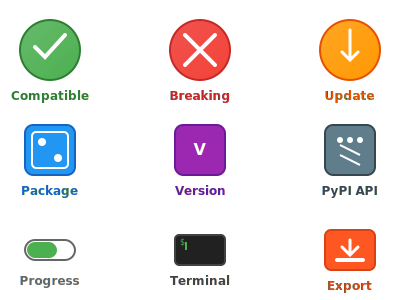

<div align="center">



# 📚 Python Dependency Reader Documentation

**Comprehensive guides and references for mastering PDR**

</div>

---

## 📖 Documentation Overview

This directory contains complete documentation for the Python Dependency Reader project, designed to help you get the most out of this powerful dependency management tool.

### 📋 Quick Navigation

| Document | Description | Audience |
|----------|-------------|----------|
| **[Usage Guide](usage.md)** | Comprehensive user guide with examples | All Users |
| **[API Reference](api.md)** | Complete technical API documentation | Developers |
| **[Examples](examples.md)** | Practical use cases and integrations | All Users |

---

## 🚀 Getting Started

### New to PDR?
1. **Start with**: [Usage Guide](usage.md) - Learn the basics
2. **Then explore**: [Examples](examples.md) - See real-world scenarios
3. **Deep dive**: [API Reference](api.md) - Technical details

### Quick Reference

#### Essential Commands
```bash
# Basic dependency check
python main.py check

# Export results to JSON
python main.py check --output json --export results.json

# Check for breaking changes only
python main.py check --filter-type major
```

#### Common Use Cases
- **Daily Development**: Regular dependency monitoring
- **CI/CD Integration**: Automated security and compatibility checking
- **Release Preparation**: Comprehensive dependency audits
- **Team Collaboration**: Shared dependency reports

---

## 🎯 Documentation Features

### 📊 Visual Guides
- Interactive workflow diagrams
- Feature comparison charts
- SemVer compatibility illustrations

### 💡 Practical Examples
- Real command-line examples with output
- CI/CD pipeline configurations
- Integration with popular tools

### 🔧 Technical Details
- Complete API documentation
- Module architecture explanations
- Performance optimization tips

---

## 📚 Document Details

### [Usage Guide](usage.md)
**Complete user manual covering all features**

- ⚡ Quick start guide with immediate results
- 🔧 Advanced configuration options
- 📊 Output format customization
- 🔄 CI/CD integration examples
- 🛠️ Troubleshooting common issues

### [API Reference](api.md)
**Technical documentation for developers**

- 📋 Complete module documentation
- 🏗️ Architecture overview
- 🔌 Integration patterns
- ⚙️ Configuration management
- 🧪 Testing guidelines

### [Examples](examples.md)
**Real-world scenarios and use cases**

- 🏢 Enterprise deployment patterns
- 🔄 Automation workflows
- 📈 Performance optimization
- 🤝 Team collaboration setups
- 🔒 Security-focused configurations

---

## 💡 Tips for Using This Documentation

### For Beginners
1. Start with the Quick Start section in [Usage Guide](usage.md)
2. Try the basic commands with your own projects
3. Explore different output formats
4. Review the troubleshooting section when needed

### For Advanced Users
1. Check out the CI/CD integration examples
2. Explore performance optimization techniques
3. Review the API documentation for custom integrations
4. Consider contributing to the project

### For Teams
1. Establish consistent usage patterns across projects
2. Set up automated dependency monitoring
3. Create shared configuration templates
4. Document team-specific best practices

---

## 🔗 External Resources

- **Python Packaging**: [Python Packaging User Guide](https://packaging.python.org/)
- **Semantic Versioning**: [SemVer Specification](https://semver.org/)
- **PyPI Documentation**: [PyPI Help](https://pypi.org/help/)
- **Click Framework**: [Click Documentation](https://click.palletsprojects.com/)

---

## 🤝 Contributing to Documentation

Help improve these docs by:

- **Reporting Issues**: Found something unclear? Open an issue
- **Adding Examples**: Share your real-world use cases
- **Improving Clarity**: Suggest better explanations
- **Adding Screenshots**: Visual examples are always welcome

---

<div align="center">

**Questions? Check the troubleshooting sections or review the examples!**

*This documentation is designed to make PDR easy to use and understand for everyone.*

</div>